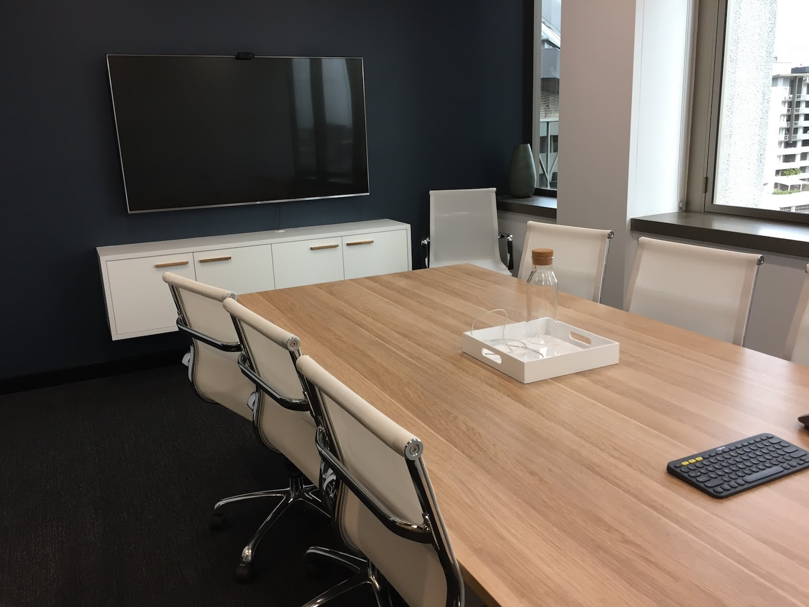
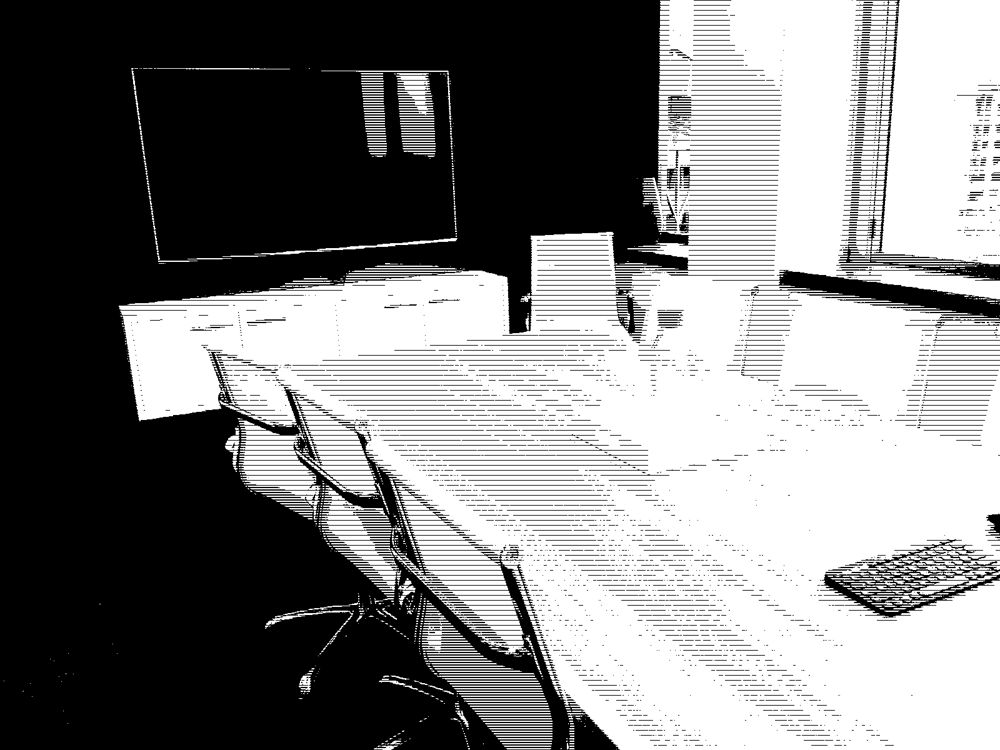

# Stacker

This is a photographic effect. It takes a JPG and translates it into five-tone greyscale, then renders those tones using horizontal lines. It looks a little like an etching.

## Example

### Input



### Output



## Setup

Install Nix then:

```
$ nix-shell --run 'cabal run -- --input ./some-image.jpg --output ./some-converted-image.jpg'
```

That should be all you need.
